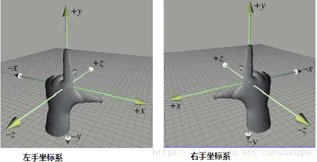
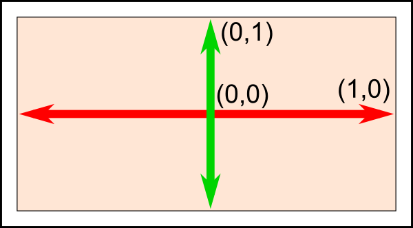

http://www.opengl-tutorial.org/beginners-tutorials/tutorial-2-the-first-triangle/

[OpenGL坐标系与坐标变换](https://www.jianshu.com/p/21bcfae7480a)

# 知识点：显卡坐标系
D3D与OpenGL坐标系统

DirectX 3D与OpenGL坐标系统的差异性，给我们带来非常大的麻烦。
让跨平台编程的新手非常困惑。近期在做一个跨平台的游戏，细致看了下两者的矩阵。
发现并没有什么大差别，将d3d左手系的矩阵传递给opengl shader全然能够正常工作。

d3d左手坐标系，opengl右手坐标系

对于显卡设备来说，设备坐标系是左手坐标系，即z轴指向屏幕里面。z值越大表示距离视线越远。

因此，opengl的右手系，在进入裁减空间的时候。会转换成左手系。

这也就是说。在渲染管线内部。坐标系是统一的。无论是左手坐标系矩阵，还是右手坐标系矩阵。仅仅要变换到裁减空间中的点是左手系就能够了。

## 世界坐标系
世界坐标系始终是固定不变的。OpenGL使用右手坐标，这里有一个形象的方法：使用右手定则
* X 是你的拇指
* Y 是你的食指
* Z 是你的中指
如果你把你的拇指指向右边，食指指向天空，那么中指将指向你的背后。我们的观察方向是Z轴负半轴的方向。


## OpenGL中的坐标系统。
从我们构造模型的局部坐标系（Local/Object Space）经过一系列处理最终渲染到屏幕坐标（Screen Space）下，这过程中有6种坐标系：
-- World Coordinates（世界坐标系）
-- Object Coordinates(对象坐标系、模型坐标系、局部坐标系或当前绘图坐标系)
-- Eye Coordinates(眼坐标系或照相机坐标系)
-- Clip Coordinates(裁剪坐标系)
-- Normalized Device Coordinates (NDC) (归一化设备坐标系)
-- Window Coordinates (Screen Coordinates)(屏幕坐标)

---
# 画三角形
OpenGL 3使得编写复杂的东西变得容易，但是以画一个简单的三角形实际上是相当困难的为代价。
> Vertex Array Object | 顶点数组对象
我现在不详细介绍，但是您需要创建一个“顶点数组对象”并将其设置为当前对象：

```c
static const GLfloat g_vertex_buffer_data[] = {
   -1.0f, -1.0f, 0.0f,
   1.0f, -1.0f, 0.0f,
   0.0f,  1.0f, 0.0f,
};
```
OpenGL这里坐标系是居中的，（-1，-1）在左下角（1，-1）是右下角（0,1）是中间的顶部




下一步是将此三角形赋予OpenGL。我们通过创建一个缓冲区来做到这一点：
```c
// This will identify our vertex buffer
GLuint vertexbuffer;
// Generate 1 buffer, put the resulting identifier in vertexbuffer
glGenBuffers(1, &vertexbuffer);
// The following commands will talk about our 'vertexbuffer' buffer
glBindBuffer(GL_ARRAY_BUFFER, vertexbuffer);
// Give our vertices to OpenGL.
glBufferData(GL_ARRAY_BUFFER, sizeof(g_vertex_buffer_data), g_vertex_buffer_data, GL_STATIC_DRAW);
```
上个例子中，主循环没有加绘制，现在吧三角加上去
```c
// 1st attribute buffer : vertices
glEnableVertexAttribArray(0);
glBindBuffer(GL_ARRAY_BUFFER, vertexbuffer);
glVertexAttribPointer(
   0,                  // attribute 0. No particular reason for 0, but must match the layout in the shader.
   3,                  // size
   GL_FLOAT,           // type
   GL_FALSE,           // normalized?
   0,                  // stride
   (void*)0            // array buffer offset
);
// Draw the triangle !
glDrawArrays(GL_TRIANGLES, 0, 3); // Starting from vertex 0; 3 vertices total -> 1 triangle
glDisableVertexAttribArray(0);
```
最后，编译命令
gcc ./x02_triangle.cpp -o openWin.bin -lglew -lglfw -framework OpenGL && ./openWin.bin

## 看不到？没关系，可能是需要着色器Shader
有的系统不支持默认Shader，所以没有白色三角形出现，接下来我们完成着色器
最小配置，至少需要2个shader：
1. Vertex Shader, 顶点着色器，对每个Vertex/顶点着色
2. Fragment Shader，片段着色器，对每个样本着色
    * 并且我们程序里有个4倍抗锯齿的配置。那么每个像素就需要4个样本

一般来说，着色器可以分开存储。 扩展名无关紧要，可以是.txt或.glsl。运行时加载一次就够了。
> OpenGL着色语言（OpenGL Shading Language）是用来在OpenGL中着色编程的语言，也即开发人员写的短小的自定义程序，他们是在图形卡的GPU （Graphic Processor Unit图形处理单元）上执行的，代替了固定的渲染管线的一部分，使渲染管线中不同层次具有可编程性。
另外一个就是读取装载方法，这里提供了一个，我放在了lib文件夹里。

### 写一个Vertex Shader
让我们先编写我们的顶点着色器。第一行告诉编译器，我们将使用OpenGL 3的语法。
```c
#version 330 core
```
第二行声明输入数据：
```c
// “vec3”是GLSL中3个组件的向量。它与用来声明三角形的glm::vec3类似（但不同）。
// 重要的是，如果我们在C ++中使用3个组件，那么在GLSL中也使用3个组件。
layout(location = 0) in vec3 vertexPosition_modelspace;
```
* `layout(location = 0)` 是为vertexPosition_modelspace提供的属性，
   * 每个顶点（vertex）可以具有许多属性：位置，一种或几种颜色，一种或几种纹理坐标以及许多其他东西。
   * OpenGL不知道颜色，只知道vec3，因此，我们必须告诉他哪个缓冲区对应于哪个输入。
   * 0 那个值也不重要，只要别超过最大限度。重要的是号要对上
* `vec3`是GLSL的一个3组件向量，它与glm::vec3类似（但不同）
   * 重要的是，如果我们在C++中使用3个组件，在GLSL中也使用3个组件。
* `vertexPosition_modelspace`就是变量名了，怎么写随便你。它将包含顶点vertex的位置
* `in`表示这是一些输入数据。很快我们将看到`out`关键字。
接下来是main函数
```C
void main(){
    gl_Position.xyz=vertexPosition_modelspace; //这里其实就是将通道对应给gl的位置属性，这个变量会从c++那边拿到3个点。分别对应xyz
    gl_Position.w=1.;
}
```
### 写一个 Fragment Shader
对于我们的第一个片段着色器，实现非常简单：

将每个片段的颜色设置为红色。 （请记住，因为我们使用4x AA（4被抗锯齿），所以一个像素中有4个片段）
```glsl
#version 330 core
out vec3 color;
void main(){
  color = vec3(1,0,0); // vec3（1,0,0）表示红色。这3数是rgb
}
```
> vscode 得装个插件，才能高亮glsl
### 合并代码，功能
```c
#include <lib/loadShader.hpp>

GLuint programID = LoadShaders( "shader/SimpleV.glsl", "shader/SimpleF.glsl" ); // 从着色器创建并编译我们的GLSL程序，要在loop之前

glClear(GL_COLOR_BUFFER_BIT | GL_DEPTH_BUFFER_BIT); // 修改背景色为蓝色


glUseProgram(programID); // 告诉OpenGL您要使用着色器：
```
升级一下编译方式，多了c++库，加一个 -lc++ 的动态库引用

`gcc ./x02_triangle.cpp -o triangle.bin -lglew -lglfw -lc++ -framework OpenGL && ./triangle.bin`

