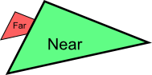
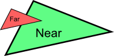

# A Colored Cube/彩色立方体
立方体有六个方形表面，而OpenGL只支持画三角形，因此需要画12个三角形，每个面两个。我们用定义三角形顶点的方式来定义这些顶点。
```C
// Our vertices. Three consecutive floats give a 3D vertex; Three consecutive vertices give a triangle.
// A cube has 6 faces with 2 triangles each, so this makes 6*2=12 triangles, and 12*3 vertices
static const GLfloat g_vertex_buffer_data[] = {
    -1.0f,-1.0f,-1.0f, // triangle 1 : begin
    -1.0f,-1.0f, 1.0f,
    -1.0f, 1.0f, 1.0f, // triangle 1 : end
    1.0f, 1.0f,-1.0f, // triangle 2 : begin
    -1.0f,-1.0f,-1.0f,
    -1.0f, 1.0f,-1.0f, // triangle 2 : end
    1.0f,-1.0f, 1.0f,
    -1.0f,-1.0f,-1.0f,
    1.0f,-1.0f,-1.0f,
    1.0f, 1.0f,-1.0f,
    1.0f,-1.0f,-1.0f,
    -1.0f,-1.0f,-1.0f,
    -1.0f,-1.0f,-1.0f,
    -1.0f, 1.0f, 1.0f,
    -1.0f, 1.0f,-1.0f,
    1.0f,-1.0f, 1.0f,
    -1.0f,-1.0f, 1.0f,
    -1.0f,-1.0f,-1.0f,
    -1.0f, 1.0f, 1.0f,
    -1.0f,-1.0f, 1.0f,
    1.0f,-1.0f, 1.0f,
    1.0f, 1.0f, 1.0f,
    1.0f,-1.0f,-1.0f,
    1.0f, 1.0f,-1.0f,
    1.0f,-1.0f,-1.0f,
    1.0f, 1.0f, 1.0f,
    1.0f,-1.0f, 1.0f,
    1.0f, 1.0f, 1.0f,
    1.0f, 1.0f,-1.0f,
    -1.0f, 1.0f,-1.0f,
    1.0f, 1.0f, 1.0f,
    -1.0f, 1.0f,-1.0f,
    -1.0f, 1.0f, 1.0f,
    1.0f, 1.0f, 1.0f,
    -1.0f, 1.0f, 1.0f,
    1.0f,-1.0f, 1.0f
};
```
解惑：
* 现在都是手动写，以后需要动态倒入模型
* 上面数据有冗余，以后在谈怎么优化

修改之前的代码，把绘制三角形的3个点，乘12，将这个立方体绘制出来.
```C
// Draw the triangle !
glDrawArrays(GL_TRIANGLES, 0, 12*3); // 12*3 indices starting at 0 -> 12 triangles -> 6 squares
```
# 增色添彩
OpenGL术语中称之为”属性（attribute）”。其实我们之前已用`glEnableVertexAttribArray()`和`glVertexAttribPointer()`设置过属性了。现在加上颜色属性，代码很相似。

缓冲的创建、绑定和填充方法与之前一样：
```C
GLuint colorbuffer;
glGenBuffers(1, &colorbuffer);
glBindBuffer(GL_ARRAY_BUFFER, colorbuffer);
glBufferData(GL_ARRAY_BUFFER, sizeof(g_color_buffer_data), g_color_buffer_data, GL_STATIC_DRAW);
```
配置也一样：(注意一下shader的layout改成1了)
```C
// 2nd attribute buffer : colors
glEnableVertexAttribArray(1);
glBindBuffer(GL_ARRAY_BUFFER, colorbuffer);
glVertexAttribPointer(
    1,                                // attribute. No particular reason for 1, but must match the layout in the shader.
    3,                                // size
    GL_FLOAT,                         // type
    GL_FALSE,                         // normalized?
    0,                                // stride
    (void*)0                          // array buffer offset
);
```
现在在顶点着色器中已经能访问这个新增的缓冲了：
```C
// Notice that the "1" here equals the "1" in glVertexAttribPointer
layout(location = 1) in vec3 vertexColor;
```
```C
// Output data ; will be interpolated for each fragment.
out vec3 fragmentColor;

void main(){

    [...]

    // The color of each vertex will be interpolated
    // to produce the color of each fragment
    fragmentColor = vertexColor;
}
```
在片段着色器中要再次声明片段颜色：
```C
// Interpolated values from the vertex shaders
in vec3 fragmentColor;
```
```C
// Ouput data
out vec3 color;

void main(){
    // Output color = color specified in the vertex shader,
    // interpolated between all 3 surrounding vertices
    color = fragmentColor;
}
```

`gcc ./x04_cube.cpp -o cube.bin -lglew -lglfw -lc++ -framework OpenGL && ./cube.bin`

要点：
1. 第二课解决平面图形
2. 第三课解决透视问题，都是为了给立方体做铺垫
3. 将透视平面，改成透视立体图。要注意这几节课的代码是递进关系。不要遗漏

## 深度缓冲（Z-Buffer）
三角形反复重绘的时候，远视角三角形，就会覆盖到近三角上。



这里，就需要计算三角形的深度问题。

解决方案是：在缓冲中存储每个片段的深度（即”Z”值）；并且每次绘制片段之前要比较当前与先前片段的深度值，看谁离摄像机更近。

可以自己实现深度缓冲，但让硬件自动完成更简单：
```C
// Enable depth test
glEnable(GL_DEPTH_TEST);
// Accept fragment if it closer to the camera than the former one
glDepthFunc(GL_LESS);
```
每次重绘的时候，你还需要清除除了颜色以外每一帧（frame）的深度。
```C
// Clear the screen
glClear(GL_COLOR_BUFFER_BIT | GL_DEPTH_BUFFER_BIT);
```