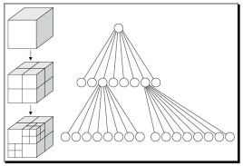

# 二叉树
* Binary tree 二叉树
    * 一个根两个节点，逐次递归的东西，连续递归查找，不会丢数据
* 二叉排序树（Binary Sort Tree），又称二叉查找树（Binary Search Tree），亦称二叉搜索树
    * 根与节点有大小关系，`左<根<右` 的顺序放置数据。
    * 一般情况下，查询效率比链表结构要高;
* 笛卡尔树 Cartesian tree
    * 没看懂。。。下次再说。
    * https://oi-wiki.org/ds/cartesian-tree/
# 自平衡二叉查找树	
* Balanced BinaryTree，平衡二叉树，AVL树
    * 它是一棵空树或它的左右两个子树的高度差的绝对值不超过1，并且左右两个子树都是一棵平衡二叉树。
    * 插入数据后，调整树结构，维持一个金字塔形状，从而查询时间基本一致，不会因为一个节点特别深，导致查询时间上升。
    * http://blog.ztgreat.cn/article/46
* Splay tree 伸缩树，分裂树，伸展树
    * https://en.wikipedia.org/wiki/Splay_tree
    * 每次查询，叶节点提前到根节点，平衡树变种，
    * 优点，多次查询同一个值，节点就更向根节点靠近，速度就快
    * dart的set集合使用它实现，
* 

# 空间划分树
* 八叉树（Octree）
    * 
    * 用在3D空间中的场景管理，可以很快地知道物体在3D场景中的位置，或侦测与其它物体是否有碰撞以及是否在可视范围内。
* 